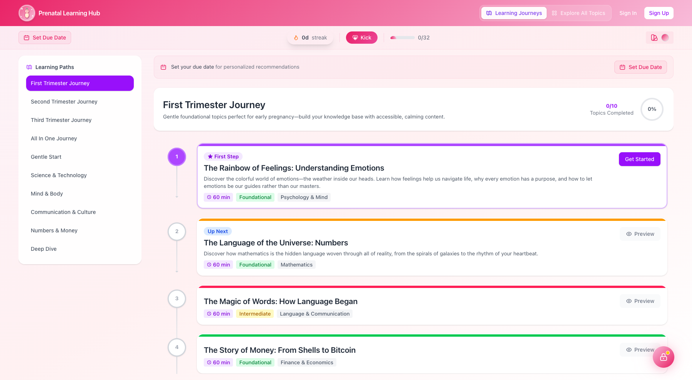
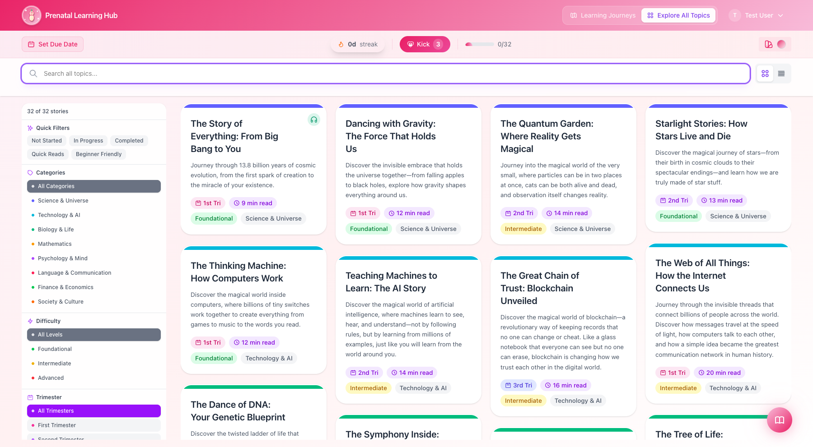
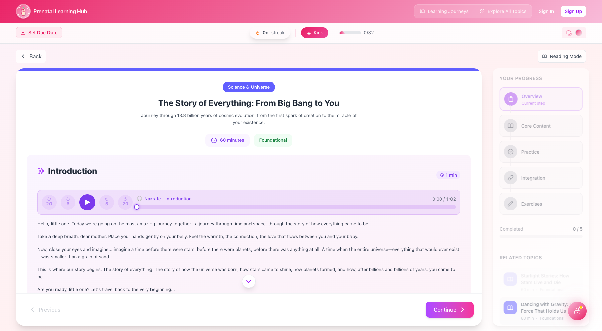
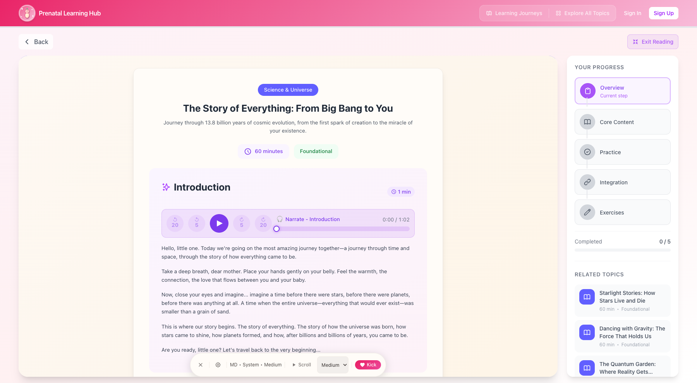
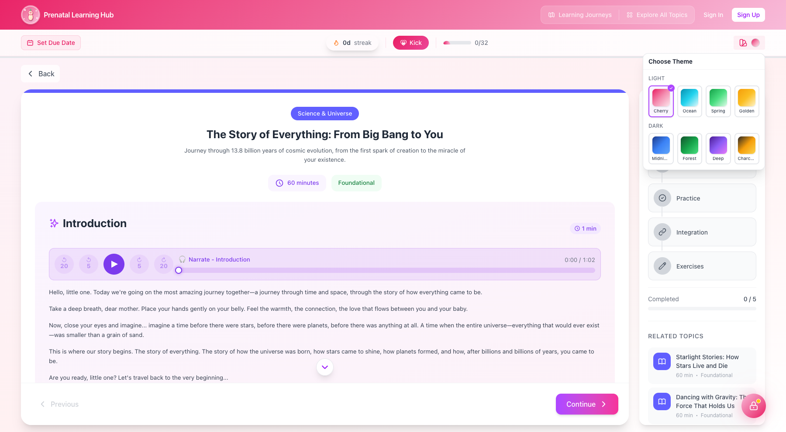
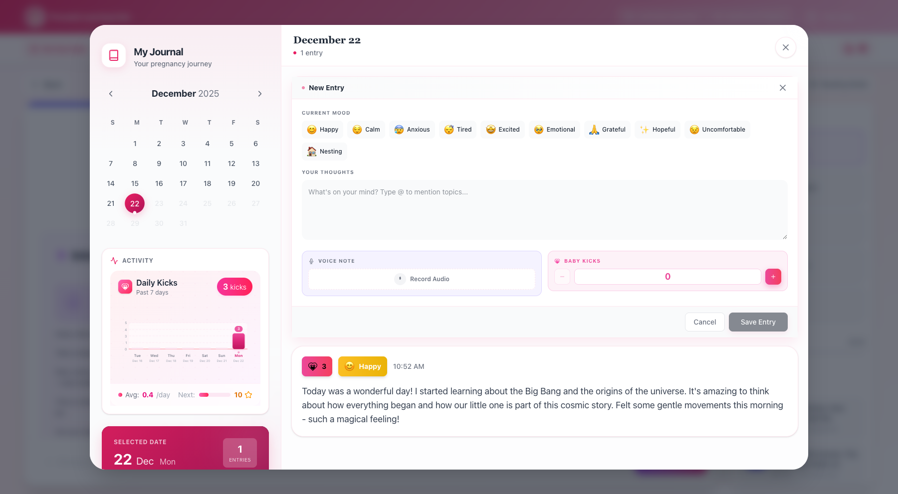
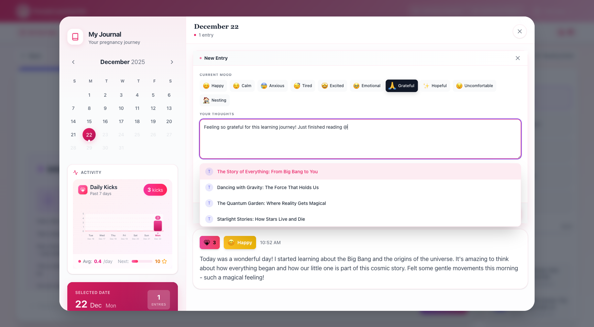
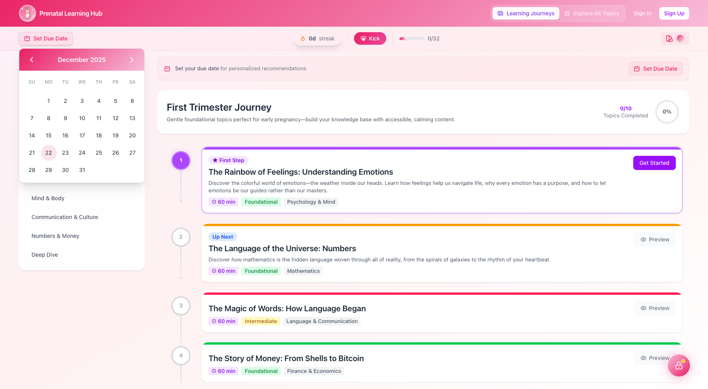
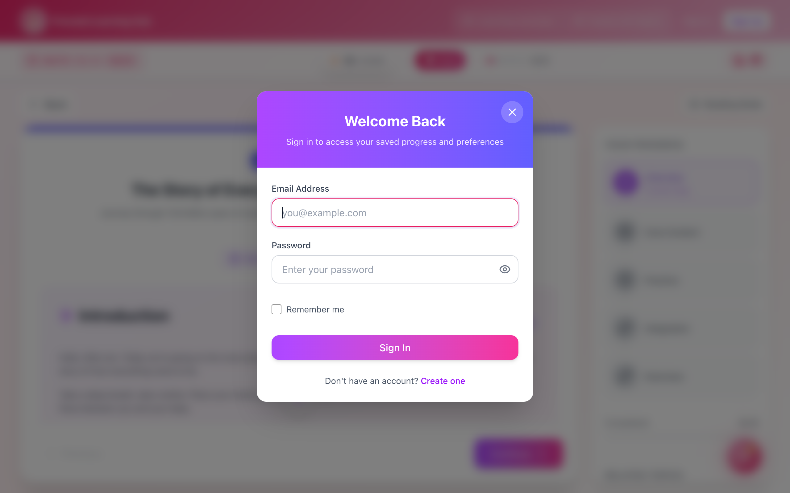
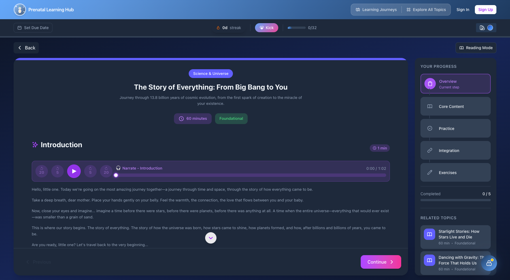

# Prenatal Learning Hub

A beautiful, interactive web application designed to help expectant parents bond with their baby through educational stories, activities, and exercises during pregnancy.

**🌐 Live Demo: [prenatal.keyurgolani.photography](https://prenatal.keyurgolani.photography)**



## What is Prenatal Learning Hub?

Prenatal Learning Hub is a gentle, nurturing platform that helps expectant parents share knowledge and create meaningful connections with their baby during pregnancy. Through beautifully crafted educational content, audio narration, and interactive features, you can embark on a learning journey that benefits both you and your little one.

## Features

### 📚 32 Educational Topics

Explore a rich library of topics across 8 categories, each designed to be engaging, calming, and educational:

- **Science & Universe** - From the Big Bang to quantum physics
- **Technology & AI** - How computers, the internet, and AI work
- **Biology & Life** - DNA, the human body, and evolution
- **Mathematics** - Numbers, infinity, and nature's patterns
- **Psychology & Mind** - Emotions, memory, and consciousness
- **Language & Communication** - Words, music, and body language
- **Finance & Economics** - Money, markets, and wealth building
- **Society & Culture** - Diversity, ethics, and democracy



See the complete [list of topics](docs/TOPICS.md) for detailed descriptions.

### 🎧 Audio Narration

Listen to soothing narrations of each topic, perfect for relaxing while learning. Audio controls include play/pause, skip forward/back, and progress tracking.



### 📖 Reading Mode

Enter a distraction-free reading experience with:

- Auto-scroll at adjustable speeds (slow, medium, fast)
- Reading progress indicator
- Customizable themes and font sizes
- Quick access to kick logging



### 🎨 Beautiful Themes

Choose from 8 carefully designed themes to match your mood:

**Light Themes:**

- Cherry Blossom (pink)
- Ocean Calm (blue)
- Spring Meadow (green)
- Golden Sunset (orange)

**Dark Themes:**

- Midnight Blue
- Forest Night
- Deep Cosmos
- Charcoal Ember



### 📅 Learning Paths

Follow curated learning journeys organized by:

- **Trimester** - First, Second, Third, or All-in-One
- **Interest** - Science & Technology, Mind & Body, Communication & Culture, Numbers & Money
- **Pace** - Gentle Start for beginners, Deep Dive for curious minds

Track your progress with visual indicators showing completed topics and percentage.

### 📓 Personal Journal

Document your pregnancy journey with a feature-rich journal:

- **Calendar view** with entry indicators
- **Mood tracking** with 10 mood options (Happy, Calm, Anxious, Tired, Excited, Emotional, Grateful, Hopeful, Uncomfortable, Nesting)
- **Text entries** with @ mentions to link topics you've learned
- **Voice notes** for hands-free journaling
- **Kick tracking** integrated into entries



Use @ to mention topics in your journal entries:



### 👶 Kick Counter

Track your baby's movements throughout the day:

- Quick-tap kick logging from anywhere in the app
- Daily kick statistics and charts
- 7-day activity visualization
- Goal tracking (next milestone indicator)

### 🔥 Streak Tracking

Stay motivated with daily learning streaks:

- Visual streak counter in the header
- Encouragement to maintain your learning habit

### 📱 Due Date Tracking

Set your due date for personalized recommendations:

- Trimester-appropriate topic suggestions
- Countdown to your special day



### ☁️ Cloud Sync

Create an account to:

- Sync progress across all your devices
- Never lose your journal entries or kick data
- Automatic migration of guest data when you sign up



### 🌙 Dark Mode Support

Comfortable viewing in any lighting condition with full dark mode support across all themes.



## Getting Started

Simply visit [prenatal.keyurgolani.photography](https://prenatal.keyurgolani.photography) to start your learning journey. No account required—you can use all features as a guest with local data storage.

For the best experience:

1. Set your due date for personalized recommendations
2. Choose a theme that feels calming to you
3. Start with the "First Trimester Journey" or "Gentle Start" learning path
4. Use the journal to document your thoughts and feelings
5. Track kicks to bond with your baby's movements

---

## Self-Hosting

Want to run your own instance? See the [Self-Hosting Guide](#self-hosting-guide) below.

### Prerequisites

- Node.js 20+
- pnpm 9+ (recommended) or npm
- MongoDB (for backend)

### Quick Start

1. Clone the repository:

   ```bash
   git clone https://github.com/keyurgolani/PrenatalLearning.git
   cd PrenatalLearning
   ```

2. Install dependencies:

   ```bash
   corepack enable
   pnpm install
   ```

3. Start with Docker (recommended):

   ```bash
   cp .env.example .env
   # Edit .env and set JWT_SECRET
   pnpm run docker:dev
   ```

4. Open [http://localhost:8080](http://localhost:8080)

### Available Scripts

| Command                | Description                       |
| ---------------------- | --------------------------------- |
| `pnpm run dev`         | Start frontend development server |
| `pnpm run dev:server`  | Start backend development server  |
| `pnpm run dev:all`     | Start all dev servers in parallel |
| `pnpm run docker:dev`  | Start full stack with Docker      |
| `pnpm run docker:prod` | Start production environment      |
| `pnpm run build:all`   | Build all packages                |
| `pnpm run test:all`    | Run all tests                     |

See the full list of commands in the [Development Guide](CONTRIBUTING.md#development-workflow).

### Environment Variables

| Variable                     | Description                | Default    |
| ---------------------------- | -------------------------- | ---------- |
| `JWT_SECRET`                 | Secret key for JWT signing | Required   |
| `MONGO_INITDB_ROOT_USERNAME` | MongoDB admin username     | `admin`    |
| `MONGO_INITDB_ROOT_PASSWORD` | MongoDB admin password     | `password` |
| `FRONTEND_PORT`              | Frontend port              | `8080`     |
| `BACKEND_PORT`               | Backend API port           | `3001`     |

See `.env.example` for all configuration options.

### Docker Deployment

```bash
# Development
pnpm run docker:dev

# Production
pnpm run docker:prod
```

### Kubernetes Deployment

```bash
# Development
pnpm run k8s:dev:build
pnpm run k8s:dev:apply

# Production
pnpm run k8s:prod:apply
```

See `infra/k8s/README.md` for detailed Kubernetes documentation.

## Tech Stack

- **Frontend**: React 19, TypeScript, Vite, Tailwind CSS
- **Backend**: Node.js, Express, MongoDB
- **Infrastructure**: Docker, Kubernetes, nginx

## Contributing

We welcome contributions! See [CONTRIBUTING.md](CONTRIBUTING.md) for guidelines.

### Community Contributions Needed

- **Illustration Images** - Better quality artwork for story content
- **Audio Narration** - Professional TTS or voice actor recordings
- **Translations** - Help translate content to other languages

## License

This project is open source and available under the [MIT License](LICENSE).

## Author

**Keyur Golani** - [GitHub](https://github.com/keyurgolani)
