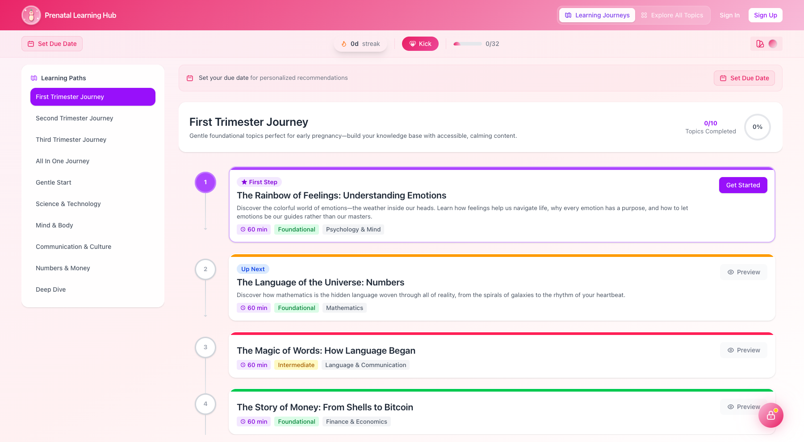
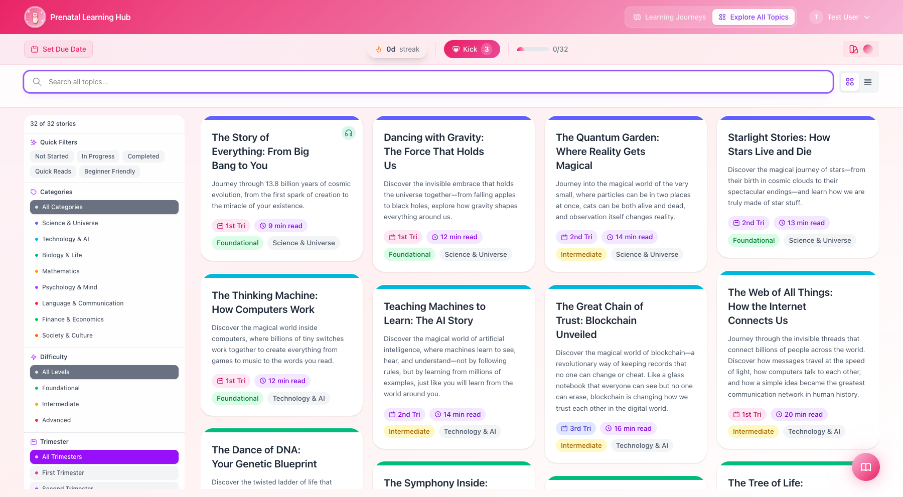
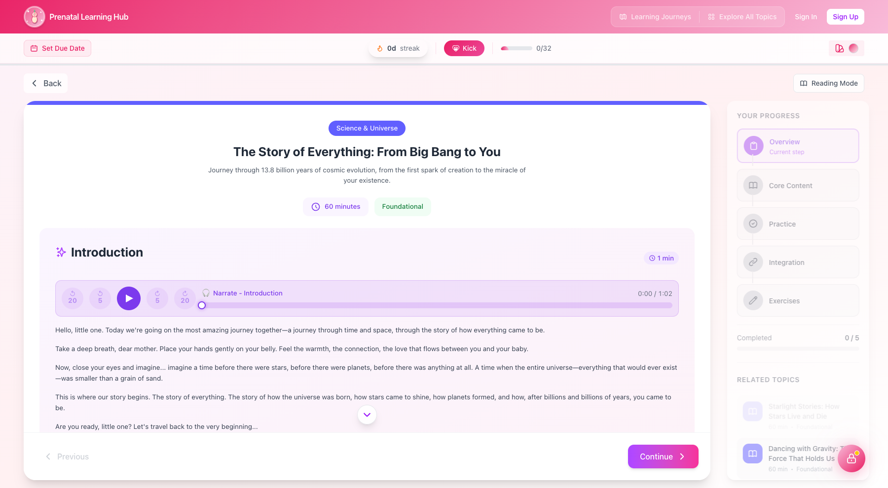
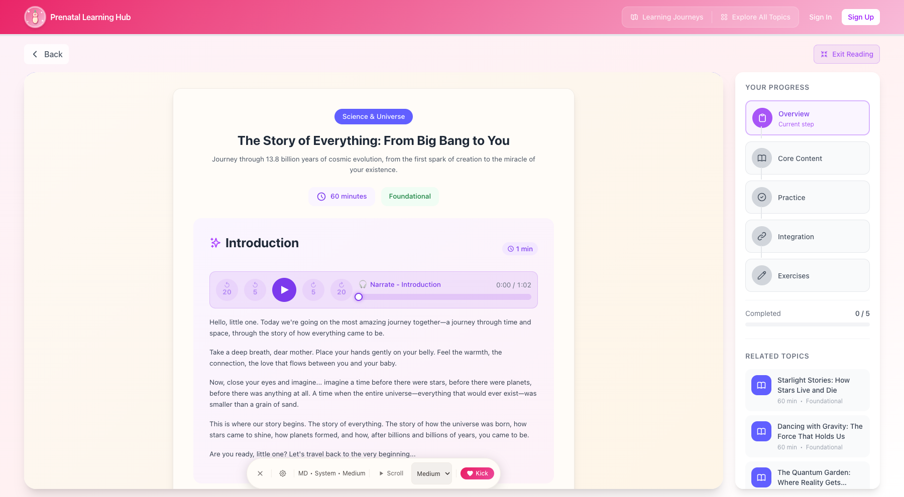
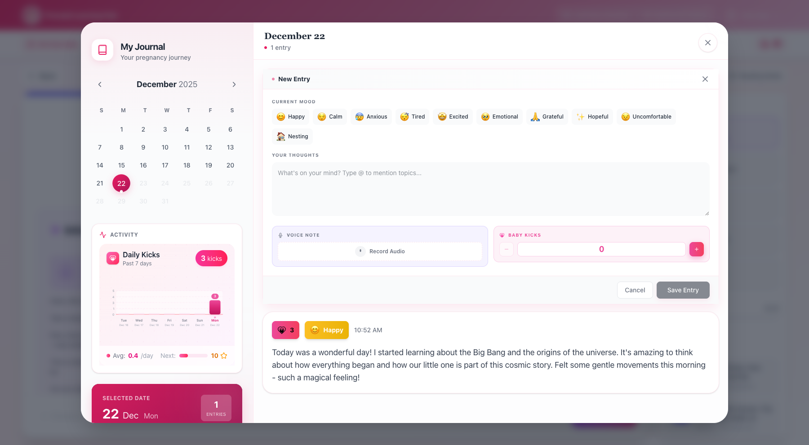
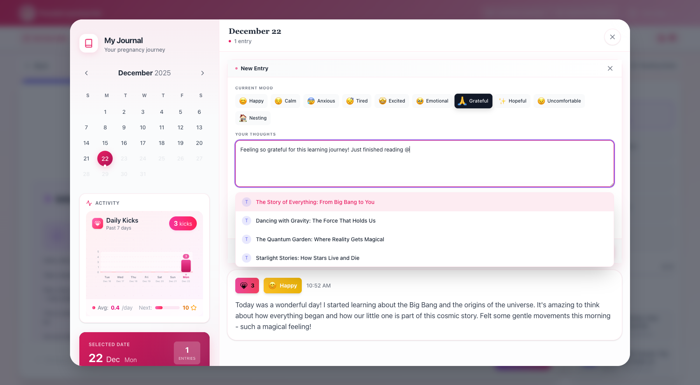
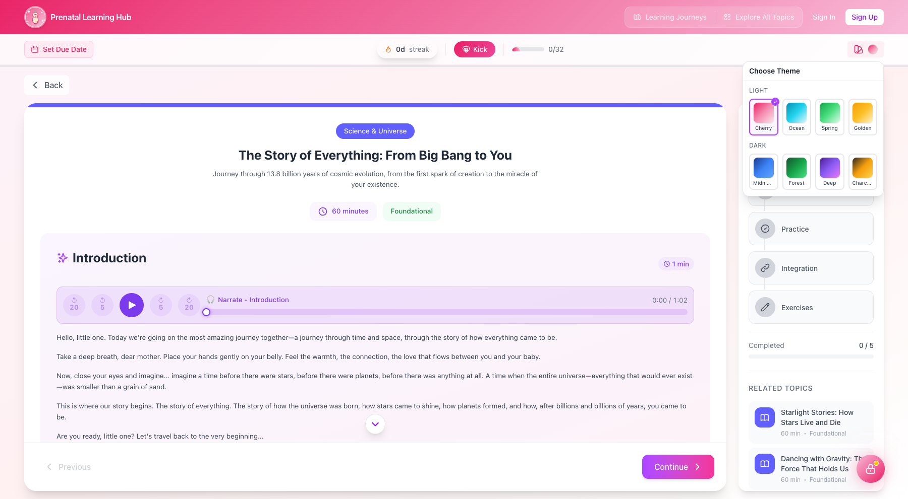
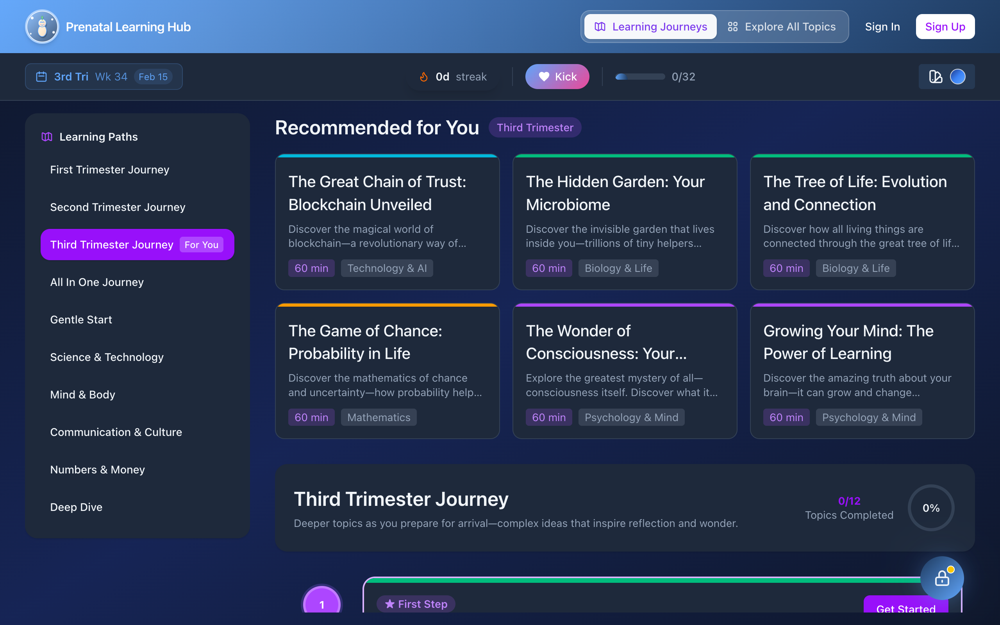
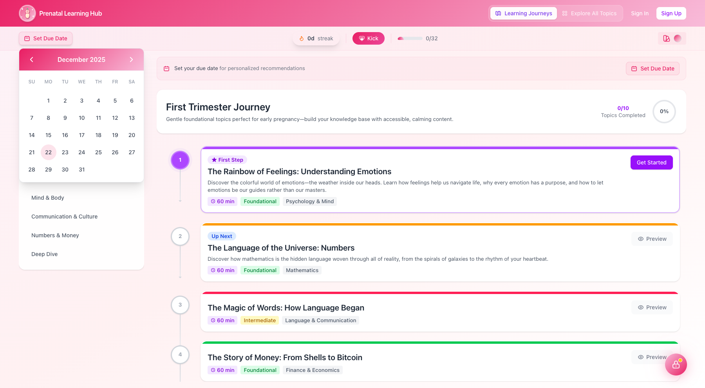
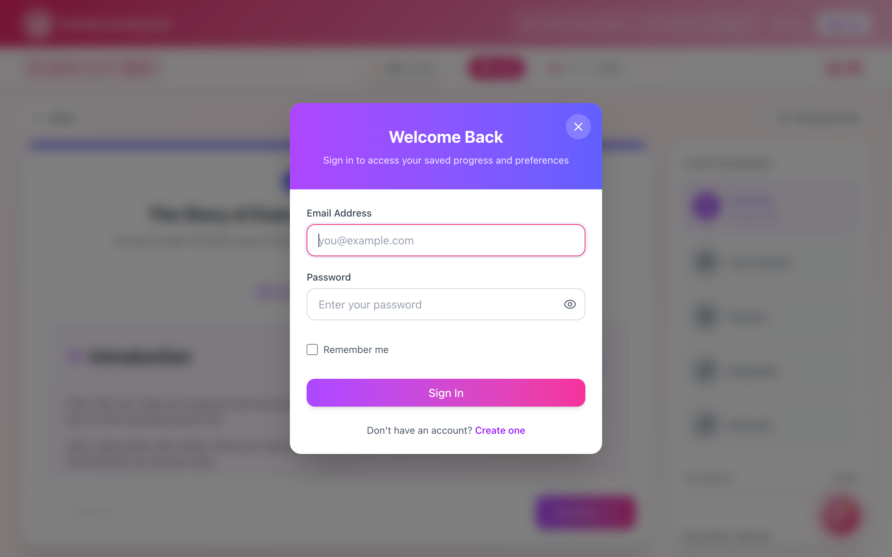

# 🤰 Prenatal Learning Hub — Visual Showcase

A gentle, interactive web app that helps expectant parents bond with their baby through educational stories, activities, and exercises during pregnancy — with audio narration, a reflective journal, and calming theming.

> _These captures use the application's existing screenshot set in `docs/screenshots/`, verified against the current UI._

---

## 🧭 Learning Journey
A personalized home with trimester-aware "Recommended for You" topics, learning paths by interest, a streak tracker, and kick counting.

## 🔍 Explore Topics
Browse the full library of 35 topics across 8 categories.

## 📖 Topic Content & Audio Narration
Read beautifully-formatted educational content with audio narration for hands-free, calming listening.

## 🛋️ Reading Mode
A distraction-free reading experience.

## 📓 Journal
A reflective journal to capture thoughts during pregnancy — with topic mentions linking entries to what you're learning.

  
  

## 🎨 Theming (Light & Dark)
Multiple calming themes, including a full dark mode for nighttime reading.

  
  

## 🗓️ Due Date & Account
Set your due date to personalize trimester-aware content, and sign in to sync your journey.

  
  

---

## ✨ At a Glance

| Capability | Detail |
|------------|--------|
| **Content** | 35 educational topics across 8 categories |
| **Audio** | Narration for hands-free, calming listening |
| **Personalization** | Trimester-aware recommendations from your due date |
| **Journal** | Reflective entries with topic mentions/linking |
| **Theming** | Multiple themes incl. full dark mode |
| **Stack** | React + Vite · Node/Express server · MongoDB · pnpm + Turborepo · Docker/K8s |

---

_See the [README](README.md) for self-hosting (Docker Compose / Kubernetes) and setup._
